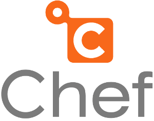

# Chef-Client

.fx: first

Emre Can Yılmaz `ecylmz@bil.omu.edu.tr`

[http://ecylmz.com/](http://ecylmz.com)

Nisan 2012

---

# Client Kurulumu ve Yapılandırılması

---

# Client Kurulumu

Ubuntu'da Chef 0.10.x icin:

    echo "deb http://apt.opscode.com/ `lsb_release -cs`-0.10 main" | sudo tee /etc/apt/sources.list.d/opscode.list

---

GPG Anahtarı Ekleyelim:

    $ sudo mkdir -p /etc/apt/trusted.gpg.d
    $ gpg --keyserver keys.gnupg.net --recv-keys 83EF826A
    $ gpg --export packages@opscode.com | sudo tee /etc/apt/trusted.gpg.d/opscode-keyring.gpg > /dev/null

**Sorun çıkması halinde**

    $ gpg --fetch-key http://apt.opscode.com/packages@opscode.com.gpg.key
    $ gpg --export packages@opscode.com | sudo tee /etc/apt/trusted.gpg.d/opscode-keyring.gpg > /dev/null

---

Opscode Deposu etkinleştirilir ve varolan paketler yükseltilir:

    $ sudo apt-get update
    $ sudo apt-get install opscode-keyring # permanent upgradeable keyring
    $ sudo apt-get upgrade

---

Chef paketi yüklenir:

    sudo apt-get install chef

Bu sırada ekrana chef-server url istenir:

    http://foo.example.com:4000

---

# Client Yapılandırma

    $ sudo mkdir -p /etc/chef

chef-server'dan `/etc/chef/validation.pem` bu client'a `/etc/chef` altına kopyalanır.

---

client.rb oluşturulur:

    $ knife configure client ./

oluşturulan client.rb `/etc/chef` altına atılır.

oluşturulan `client.rb`nin içeriği minimum şu şekilde olmalı:

    log_level        :info
    log_location     STDOUT
    chef_server_url  'http://yourchefserver.com:4000'
    validation_client_name 'chef-validator'

---

Her şey tamamsa son işlem olarak `chef-client` çalıştırılır:

    $ sudo chef-client

Herhangi bir sorun yoksa chef-server'da client ve node'u oluşturur.
Varsa run_list çalıştırılır.

---
